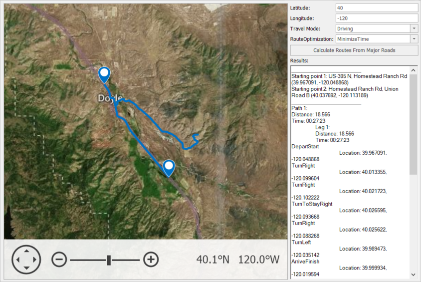

<!-- default badges list -->

<!-- default badges end -->

# Map for WinForms - Use the Bing Maps Route Web Service to Calculate Routes from Major Roads

This example demonstrates how to receive route information from the [Bing Maps route service](https://docs.microsoft.com/en-us/bingmaps/rest-services/routes/) to calculate routes to the destination point from major roads, and how to display information about the resulting routes.

> **NOTE:** You are required to specify the Bing Maps key to use Bing Maps services. Refer to the following tutorial for more information: [How to: Get a Bing Maps Key](https://docs.devexpress.com/WindowsForms/15102/controls-and-libraries/map-control/examples/general/how-to-get-a-bing-maps-key).

The main steps required to create such an application are described below.

Create a [`BingRouteDataProvider`](https://docs.devexpress.com/WindowsForms/DevExpress.XtraMap.BingRouteDataProvider?p=netframework) object and assign it to the [InformationLayer.DataProvider](https://docs.devexpress.com/WindowsForms/DevExpress.XtraMap.InformationLayer.DataProvider) property.

Specify destination point coordinates ([GeoPoint.Latitude](https://docs.devexpress.com/WindowsForms/DevExpress.XtraMap.GeoPoint.Latitude) and [GeoPoint.Longitude](https://docs.devexpress.com/WindowsForms/DevExpress.XtraMap.GeoPoint.Longitude)). In addition, you can specify optional parameters (the destination name, driving or walking route travel mode, and route optimization options) to calculate the optimal route by time or by distance. To do this, set the [BingRouteOptions.Mode](https://docs.devexpress.com/WindowsForms/DevExpress.XtraMap.BingRouteOptions.Mode) and [BingRouteOptions.RouteOptimization](https://docs.devexpress.com/WindowsForms/DevExpress.XtraMap.BingRouteOptions.RouteOptimization) properties.

To calculate a route, click the **Calculate Routes From Major Roads** button. All parameters are passed to the [BingRouteDataProvider.CalculateRoutesFromMajorRoads](https://docs.devexpress.com/WindowsForms/DevExpress.XtraMap.BingRouteDataProvider.CalculateRoutesFromMajorRoads.overloads?p=netframework) method. After that, the map will display the calculated route, and the <strong>rich text box</strong> element will contain the route information. You can access the route information in the [BingRouteDataProvider.RouteCalculated](https://docs.devexpress.com/WindowsForms/DevExpress.XtraMap.BingRouteDataProvider.RouteCalculated?p=netframework) event arguments.

The provider generates [map items](https://docs.devexpress.com/WindowsForms/15091/controls-and-libraries/map-control/vector-data/vector-items?p=netframework) to display the route and waypoints since its [GenerateLayerItems](https://docs.devexpress.com/WindowsForms/DevExpress.XtraMap.InformationDataProviderBase.GenerateLayerItems?p=netframework) property is enabled. You can handle the [InformationDataProviderBase.LayerItemsGenerating](https://docs.devexpress.com/WindowsForms/DevExpress.XtraMap.InformationDataProviderBase.LayerItemsGenerating?p=netframework) event to customize the item appearance.

## Files to Look At

* [Form1.cs](./CS/CalculateRoutesFromMajorRoads/Form1.cs) (VB: [Form1.vb](./VB/CalculateRoutesFromMajorRoads/Form1.vb))

## Documentation

* [How to: Calculate Routes from Major Roads Using the Bing Maps Route Service](https://docs.devexpress.com/WindowsForms/16666/controls-and-libraries/map-control/examples/gis-data/routing/how-to-calculate-routes-from-major-roads-using-the-bing-route-service?p=netframework)
* [Routing](https://docs.devexpress.com/WindowsForms/16713/controls-and-libraries/map-control/gis-data/routing?p=netframework)

## More Examples

* [How to zoom a map to a calculated route using the RouteCalculated event](https://github.com/DevExpress-Examples/how-to-zoom-a-map-to-a-calculated-route-using-the-routecalculated-event-t363647)
* [How to Implement a Custom Route Provider](https://github.com/DevExpress-Examples/how-to-implement-a-custom-route-provider-t410669)
* [How to implement a route calculator using GIS providers](https://github.com/DevExpress-Examples/how-to-implement-a-route-calculator-using-gis-providers-t187741)
* [How to calculate a route between waypoints and customize the appearance of a route path using a Microsoft Bing Maps Route web service](https://github.com/DevExpress-Examples/how-to-calculate-a-route-between-waypoints-and-customize-the-appearance-of-a-route-path-usin-e5100)
* [How to calculate a route between two addresses](https://github.com/DevExpress-Examples/how-to-calculate-a-route-between-two-addresses-t364143)
* [How to manually generate map items for location information received from the Bing Search provider](https://github.com/DevExpress-Examples/manually-generate-map-items-for-location-information-received-from-the-bing-search-provider-t188838)
* [How to get additional search results using the Bing Map Search service](https://github.com/DevExpress-Examples/how-to-get-additional-search-results-using-the-bing-map-search-service-e5066)
